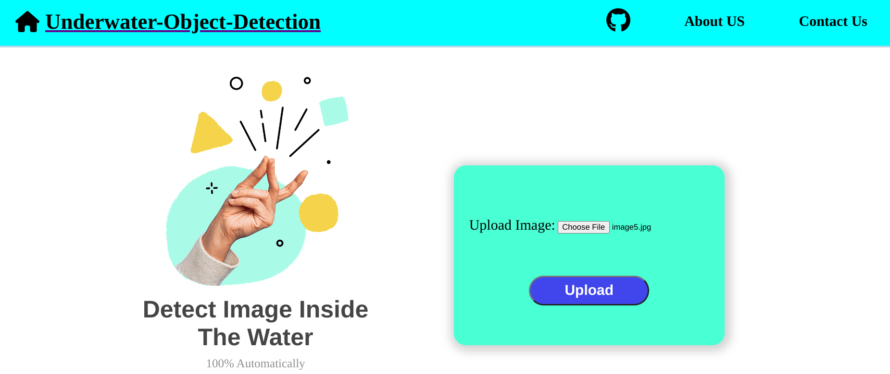

# Underwater-Object-Detection using YOLOv8.1
  

## Introduction
<p>
The Underwater Object Detection WebApp is an intuitive online tool for marine researchers, underwater explorers. Users can detect and classify submerged objects such as wreckage or marine life, visualize results through interactive image galleries. With its user-friendly interface and powerful capabilities, the web app facilitates efficient underwater exploration.
</p>

## Detection
* Step 1: Clone the repository.
```bash
git clone https://github.com/sumit2011/underwater-object-detection
```

* Step 2: Create and activate virtual environment.
> for linux
```bash
virtualenv myenv
```
```bash
source myenv/bin/activate
```


* Step 3: Installing require modules.
```bash
pip install -r requirements.txt
```

* Step 4: Run the script.
```bash
python -u app.py
```
* Step 5: Open the link 


## log output
```python
┌──(yoloenv)─(sumit㉿mr-nob0dy)-[~/Desktop/underwater_object_detection]
└─$ python -u "/home/sumit/Desktop/underwater_object_detection/app.py"
 * Serving Flask app 'app'
 * Debug mode: off
WARNING: This is a development server. Do not use it in a production deployment. Use a production WSGI server instead.
 * Running on http://127.0.0.1:5000
Press CTRL+C to quit
127.0.0.1 - - [23/Feb/2024 21:10:14] "GET / HTTP/1.1" 200 -
127.0.0.1 - - [23/Feb/2024 21:10:14] "GET /static/images/house-solid.svg HTTP/1.1" 304 -
127.0.0.1 - - [23/Feb/2024 21:10:14] "GET /static/styles/style.css HTTP/1.1" 304 -
127.0.0.1 - - [23/Feb/2024 21:10:14] "GET /static/images/github.svg HTTP/1.1" 304 -
upload folder is  /home/sumit/Desktop/underwater_object_detection/uploads/images/image7.jpg

0: 800x608 15 jellyfishs, 243.0ms
Speed: 6.0ms preprocess, 243.0ms inference, 0.9ms postprocess per image at shape (1, 3, 800, 608)
Results saved to runs/detect/predict5
printing directory:  runs/detect/predict5
image0.jpg
127.0.0.1 - - [23/Feb/2024 21:10:28] "POST / HTTP/1.1" 200 -
```

# Annotation or labeling tool

  

This project is an online annotation tool designed to facilitate the annotation process for YOLO format datasets used in object detection tasks. The tool provides a user-friendly interface for labeling images with bounding boxes around objects of interest and assigning corresponding class labels. It aims to streamline the annotation workflow, making it easier and more efficient for researchers and developers to create annotated datasets for training YOLO-based object detection models.

## Getting Started:

To use the annotation tool, follow these steps:

1. Clone the repository:
    ```bash
    git clone https://github.com/sumit2011/underwater-object-detection.git
    ```
2. Go to the main directory:
    ```bash
        cd underwater-object-detection
    ```
3. Install flask and other dependencies:

4. Start the server:
    ```bash
    python annotate.py
    # Access the application at http://localhost:5000 in your web browser
    ```
5. Upload images that you want to annotate.
6. Draw bounding boxes around objects in the images and assign class labels.
7. Save annotation.

## Processes involved in the labeling:

1. It will take the image from user and saved to the `uploads2` folder.
2. After that it will load the image to the canva container for annotation.
3. Now user can label the objects in the image according to the class ids.
4. Now click on the `save annotation` button.
5. It will save the annotation file in yolo format in the annotations folder.
6. Name of the annotation file will be same as the image filename.

## Demo


## log output:

```python
┌──(sumit㉿mr-nob0dy)-[~/Desktop/underwater_object_detection]
└─$ python -u annotate.py 
 * Serving Flask app 'annotate'
 * Debug mode: on
WARNING: This is a development server. Do not use it in a production deployment. Use a production WSGI server instead.
 * Running on http://127.0.0.1:5000
Press CTRL+C to quit
 * Restarting with watchdog (inotify)
 * Debugger is active!
 * Debugger PIN: 134-459-391
127.0.0.1 - - [05/Mar/2024 19:40:50] "GET / HTTP/1.1" 200 -
127.0.0.1 - - [05/Mar/2024 19:40:51] "GET /static/styles/annotate.css HTTP/1.1" 304 -
127.0.0.1 - - [05/Mar/2024 19:40:51] "GET /static/js/annotate.js HTTP/1.1" 304 -
Image saved at: /home/sumit/Desktop/underwater_object_detection/uploads2/image11.jpg
127.0.0.1 - - [05/Mar/2024 19:41:02] "POST /upload HTTP/1.1" 200 -
Annotation saved at: /home/sumit/Desktop/underwater_object_detection/annotations/image11.txt
127.0.0.1 - - [05/Mar/2024 19:41:23] "POST /save_annotation HTTP/1.1" 200 -
```


